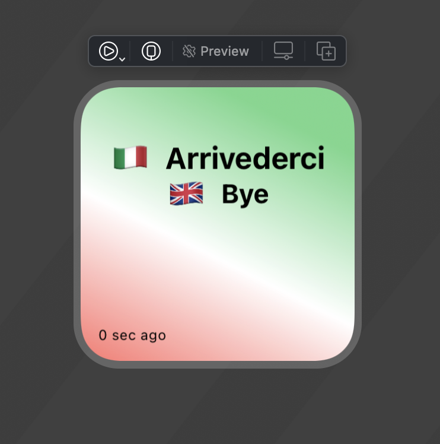

# widgetkit-daily-language

This simple SwiftUI project utilizes iOS 14's WidgetKit to display a simple, at-a-glance widget with a randomly selected `{{Foreign Word}} <-> {{Native Word}}` pair.

Learn a new language with a new word a day from a language you'd like to learn.  

Current Languages include:
* `Italian <-> English`
* `French <-> English` 
* `Japanese <-> English` 

...with wordlists [extracted](https://github.com/joshspicer/widgetkit-daily-italian/blob/main/extract.py) using a quick BeautifulSoup script from 1000mostcommonwords.com .




## Add a language

Wordlists are embedded into the widget and can be added easily.

1. Add a unique enum for your newly [Supported Language](https://github.com/joshspicer/widgetkit-daily-italian/blob/main/DailyItalianWord/SupportedLanguages.swift).
2. Create a new `.swift` file to [/Lanaguages](https://github.com/joshspicer/widgetkit-daily-italian/tree/main/DailyItalianWord/Languages) that conforms to the `LanguageBase` protocol.

### Example {{language}}.swift

```swift
class {{language}} : LanguageBase {

    var words: [Word] = [
        Word(native: "war", foreign: "guerra"),
        Word(native: "thing", foreign: "cosa"),
        Word(native: "street", foreign: "strada")
        ...
        ...
    ]       
        
    func getAll() -> [Word] {
        return words
    }
    
    func getRandom() -> Word {
        let number = Int.random(in: 0..<words.count)
        return words[number]
    }
    
    func getFlag() -> String {
        return "🇮🇹"
    }
}
```

3. Add your new class here in the [LanguageFactory.swift](https://github.com/joshspicer/widgetkit-daily-italian/blob/main/DailyItalianWord/Languages/LanguageFactory.swift).

Your language will be available in the picker! 
